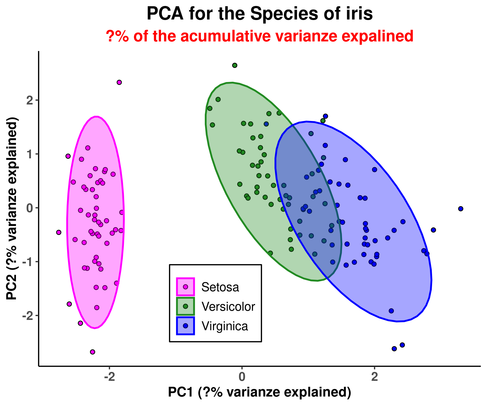

<style>
body {
text-align: justify}
</style>

# **Ejemplo para trabajar con los comandos de git**.

Mi intención con este pequeño proyecto es explicar cómo iniciarse en el mundo de GitHub mediante los comandos de **```Git```**. Para ello vamos a ver un ejemplo de cómo usaría estos comandos en mi entorno de trabajo para desde mi ordenador local y mediante el uso de la terminal/editor de texto, modificar localmente un repositorio almacenado en esta página. 

He de decir que no soy un experto. Me acabo de iniciar, pero como aprender lo poco que se de ```git``` me pareció super poco intuitivo y begginer-friendly, así que comparto lo aprendido que creo que es lo básico. Y solo eso me ha facilitado la vida de manera sustancial a la hora de interactuar con esta página.

Antes de todo esto necesitas tener a punto, 1 tu cuenta de GitHub, 2 tus credenciales y 3 tu SHH key.

## Comandos básicos (que es 80-90% de lo que se y uso):

* ```git status```: te da información actual del estado de tu repositorio.

* ```git clone``` : nos perimite clonar el repositorio de nuestra cuenta de GitHub a nuestro ordenados local.
* ```git add``` : añade los cambios que se han realizado en algún directorio/archivo.
* ```git commit -m``` : guarda los cambios y prepara al repositorio para ser "empujado" a tu cuenta online (debe hacerse después de ```git add```)
* ```git pull``` y ```git push```: el primero extrae cambios hechos en la cuenta en la red, recomendado de usar siempre antes de hacer ningún cambio en el repositorio local de tu ordenador, especielmente si trabajas con otras personas en la página (esto lo he escuchado, no he llegado a tanto). ```git push``` por otro lado es lo contrario, empuja los resultados añadidos y guardados al repositorio de  tu cuenta.

## Ejemplo de PCA de especies de iris.

Usaremos como ejemplo una script en el que hemos hecho un PCA de una base de datos que se encuentra de serie en R, se llama iris, que presenta 3 especies de esatas plantas.

### Problema: hemos realizado el suguiente gráfico con los resultados de este análisis. Queremos cambiar los "?" por los % de las varianzas explicadas y acumulada de las 2 primeras componentes:

---

<p align='center'>
    
</p>

---

### Pasos a seguir:

1) Ve al repositorio tu cuenta de GitHub, copiar el link donde pone code en verde:

<p align="center">
    
</p>

Colocandote en el directorio que quiereas de la terminal usar:

```
git clone repository
```

* Como resultado, algo por el estilo:

<p align="center">
    
</p>

Hacemos los cambios que queremos, le añadimos los % a los axis y subtítulo:

<p align="center">
    
</p>

2) Vemos lo que hay que añadir y guardar, para ello usamos únicamente el siguiente comando en la línea de comandos:

```
git status
```

<p align="center">
    
</p>

3) Ahora añadiremos los cambios y los guardaremos. para ello seguimos el siguiente orden (n son de uno a varios archivos). Por otro lado, una cosa curiosa, es que luego en commit, con hacerlo de un archivo te los comete de todos los que han sido añadidos:

```
git add file_n
git commit -m files
```

