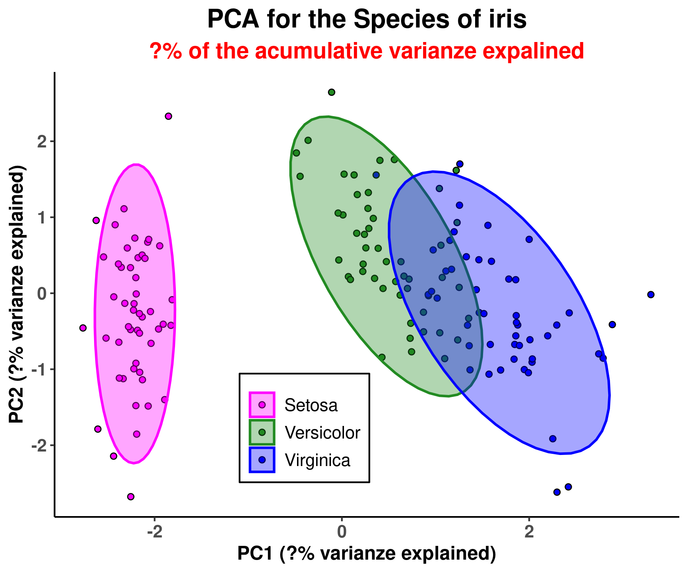
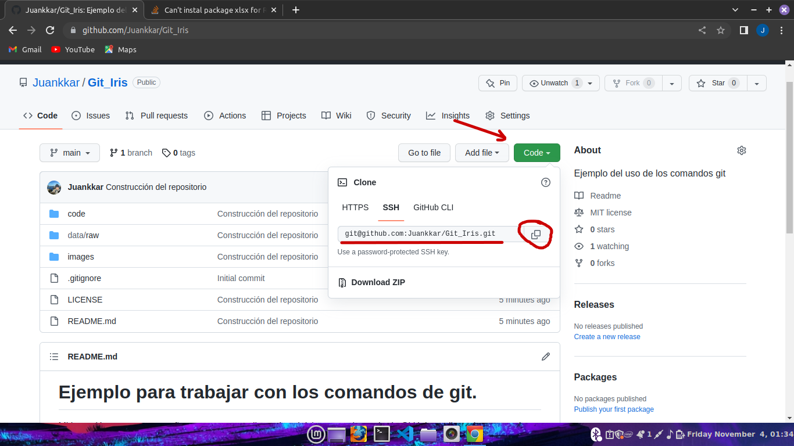
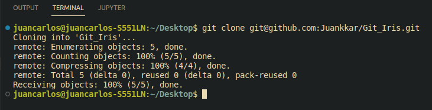
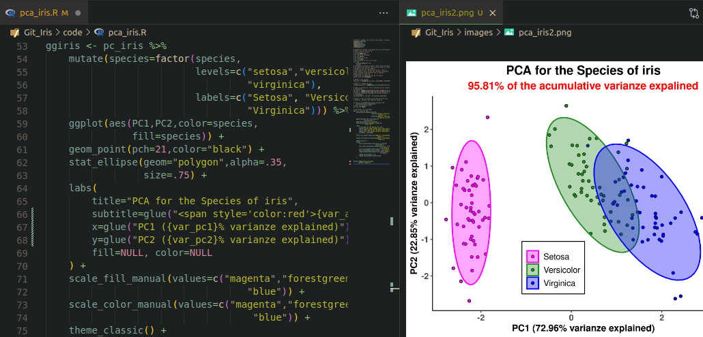
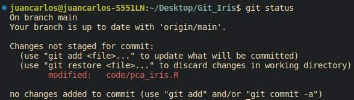
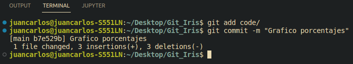
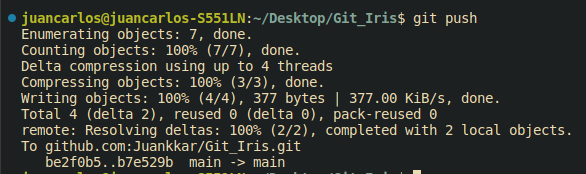
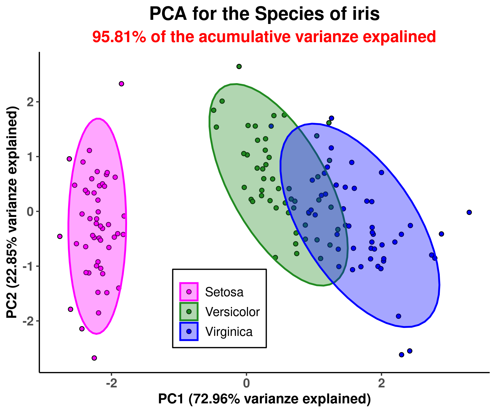
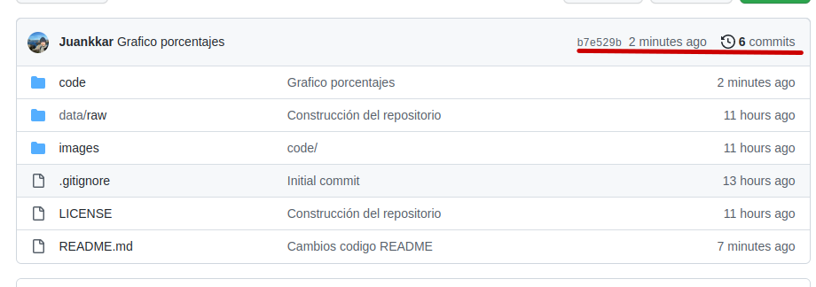
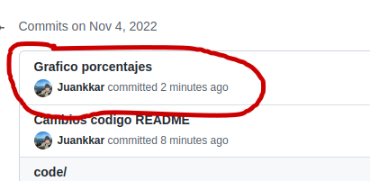

# **Ejemplo para trabajar con los comandos de git**.

1. [Intoducción](#1-introducción)

2. [Comandos básicos](#2-comandos-básicos)

3. [Ejemplo de PCA de especies de iris.](#3-ejemplo-de-pca-de-especies-de-iris)

    -   [Script a usar](#31-script-a-usar-pca_irisr)

    -   [Problema](#32-problema)

    -   [Pasos a seguir](#33-pasos-a-seguir)
    
        -   [git clone](#331-git-clone-y-añadir-porcentajes-al-script)
        -   [git status](#332-git-status)
        -   [git add y git commit -m](#333-git-add-y-git-commit)
        -   [git push](#334-git-push)

# 1) Introducción 

Este es un pequeño proyecto para intentar explicar cómo iniciarse en el mundo de GitHub mediante los comandos de **```git```**, y realizar lo que se conoce como ***"version control"***. Para ello vamos a ver un ejemplo de cómo usaría estos comandos en mi entorno de trabajo, para desde mi ordenador local y mediante el uso de la terminal/editor de texto, modificar localmente un repositorio almacenado en esta página. 

Seguramente hayan más comandos además de estos, pero con ellos puedo interactuar de una forma mucho más cómoda que actuar directamente en la web. Aprender a usar lo que se de ```git``` me pareció super poco intuitivo y begginer-friendly, así que comparto lo aprendido.

Antes de todo esto necesitas tener a punto:
1) Tu cuenta de GitHub
2) ```git``` instalado.
3) Tus credenciales 
4) Tu SSH key.

# 2) Comandos básicos 

 Esto es 80-90% de lo que se y uso:

* ```git status```: da información actual del estado de tu repositorio.

* ```git clone``` : perimite clonar el repositorio de nuestra cuenta de GitHub a nuestro ordenados local.
* ```git add``` : añade los cambios que se han realizado en algún directorio/archivo.
* ```git commit -m``` : guarda los cambios y prepara al repositorio para ser "empujado" a tu cuenta online (debe hacerse después de ```git add```). Entre comillas añades el qué, por qué del cambio.
* ```git pull``` y ```git push```: el primero extrae cambios hechos en la cuenta en la red, recomendado de usar siempre antes de hacer ningún cambio en el repositorio local de tu ordenador, especielmente si trabajas con otras personas en la página (esto lo he escuchado, no he llegado a tanto), también puede darse el caso que simplemente lo hayas modificado el repositorio directamente desde la web. ```git push``` por otro lado es lo contrario, empuja los resultados añadidos y guardados al repositorio de  tu cuenta.

# 3) Ejemplo de PCA de especies de iris.

## 3.1) Script a usar: [pca_iris.R](code/pca_iris.R)

Usaremos como ejemplo un [script](code/pca_iris.R) en el que he realizado un PCA de una base de datos que se encuentra de serie en R, se llama iris, que presenta 3 especies de estas plantas.

## 3.2) Problema: 

hemos realizado el siguiente gráfico con los resultados de este análisis. Queremos cambiar los "?" por los % de las varianzas explicadas y acumulada de las 2 primeras componentes:

---

<p align='center'>
    
</p>

---

## 3.3) Pasos a seguir:

### 3.3.1) git clone y añadir porcentajes al script.

 Ve al repositorio tu cuenta de GitHub, hacer click en code en verde copiar el link del repositorio (date cuenta que tienes que tener la SSH key para esto):

<p align="center">
    
</p>

Colocandote en el directorio de tu ordenador que quiereas trabajar, pones el siguiente comando en la CLI:

```
git clone repository
```

* Como resultado, algo por el estilo:

<p align="center">
    
</p>

Hacemos los cambios que queremos, le añadimos los % de la varianza explicada acumulada al subtítulo y los % de las varianzas acumuladas a los axis a los axis:

<p align="center">
    
</p>

### 3.3.2) git status

Vemos lo que hay que añadir y guardar, para ello usamos únicamente el siguiente comando en la línea de comandos. Se mostrará en rojo los que se ha cambiado. Una vez se añadan los cambios, si usáramos de nuevo el comando, se mostrarían en verde.

```
git status
```

<p align="center">
    
</p>

### 3.3.3) git add y git commit

3) Ahora añadiremos los cambios y los guardaremos. para ello seguimos el siguiente orden. Con commit -m guardamos los cambios y lo preparamos para mandarlos a nuestra cuenta de GitHub, entre comillas ponemos el qué o por qué del cambio.

```
git add file/s
git commit -m "Por qué del cambio" 
```

<p align="center">
    
</p>

Una vez hecho estos de ya estamos listos para empujarlo a nuestra cuenta de GitHub (lo normal es que al clonar, al hacer pull, o push, te pida tu "passphrase" de la SSH key:

### 3.3.4) git push

```
git push
```

<p align="center">
    
</p>

### Resultado: el cambio se habrá enviado a nuestro repositorio en la cuenta de GitHub. 

Y al correr nuestro código de GitHub a partir de ahora nos dará la siguiente imagen:

<p align="center">
    
</p>

Podemos ver además los commit:

<p align="center">
    
</p>

<p align="center">
    
</p>

En caso de estar en otro ordenador y que tengas también este repositorio de forma local, ahí no se habrán guardado estos cambios, así que **importante**, antes de hacer nada, lo ideal es hacer un ```git pull``` para extraer los cambios.
